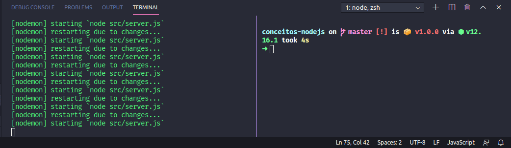

# 🚀 Desafio Conceitos Nodejs

Aplicação tem por objetivo armazenar repositórios do seu portfólio, que irá permitir a criação, listagem, atualização e remoção dos repositórios, e além disso permitir que os repositórios possam receber "likes".

🔹 Foi utilizado Array para manipulação dos dados.

